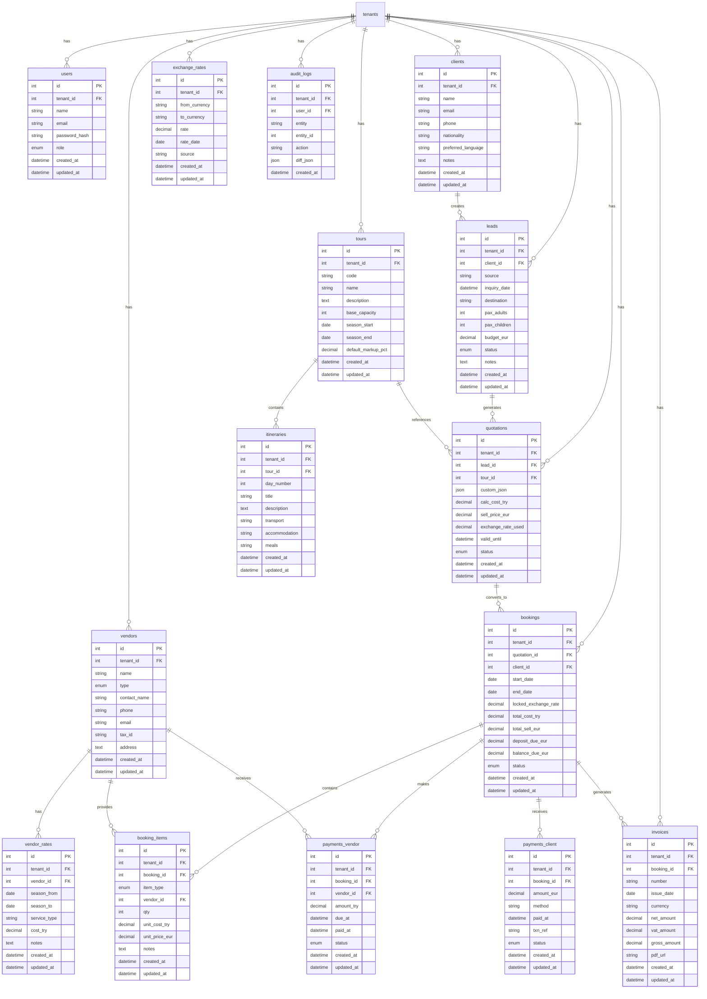

# Tour Operator CRM - Entity Relationship Diagram

## Mermaid ERD

## Key Relationships

### Multi-Tenancy
- Every business entity has `tenant_id` for complete data isolation
- Queries are automatically scoped by tenant

### Business Flow
1. **Lead Generation**: Client creates lead with inquiry
2. **Quotation**: Lead generates quotation using tour templates or custom itinerary
3. **Booking**: Accepted quotation converts to booking with locked exchange rate
4. **Items**: Booking contains items (hotels, transport, guides, activities)
5. **Payments**: Track client payments (EUR) and vendor payments (TRY)
6. **Invoice**: Generate invoice with VAT calculation

### Currency Management
- Vendor costs stored in TRY (`cost_try`)
- Client prices stored in EUR (`sell_price_eur`, `amount_eur`)
- Exchange rates tracked daily
- **Critical**: `locked_exchange_rate` frozen at booking confirmation for accounting accuracy

### Audit Trail
- All sensitive changes logged to `audit_logs`
- Tracks user, entity, action, and JSON diff

## Indexes

Key indexes for performance:
- `tenant_id` on all tables (most selective filter)
- `email` + `tenant_id` (unique constraint for users/clients)
- `status` fields for filtering
- `rate_date` on exchange_rates
- Foreign keys for joins

## Enum Values

### UserRole
- `OWNER`, `ADMIN`, `AGENT`, `OPERATIONS`, `ACCOUNTING`, `GUIDE`, `VENDOR`

### LeadStatus
- `NEW`, `CONTACTED`, `QUOTED`, `WON`, `LOST`

### QuotationStatus
- `DRAFT`, `SENT`, `ACCEPTED`, `REJECTED`

### BookingStatus
- `PENDING`, `CONFIRMED`, `CANCELLED`, `COMPLETED`

### VendorType
- `HOTEL`, `TRANSPORT`, `GUIDE`, `ACTIVITY`

### ItemType
- `HOTEL`, `TRANSFER`, `GUIDE`, `ACTIVITY`, `FEE`, `DISCOUNT`

### PaymentStatus
- `PENDING`, `COMPLETED`, `FAILED`, `REFUNDED`
